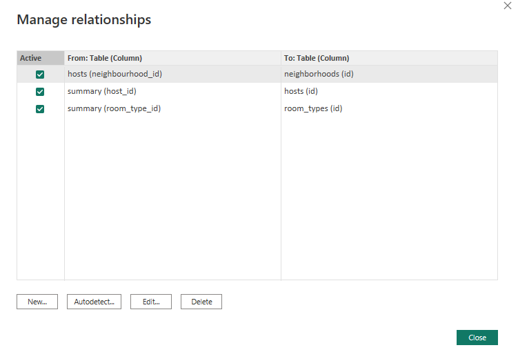

 <a href="https://achmadirfana.github.io/portofolio/portfolio-details.html">Back</a>

<h2> Air BnB Dashboard </h2>

 URL Dashoboard project : <a href="https://app.powerbi.com/view?r=eyJrIjoiMjM1NjE5ZmItZGYxNC00MTcxLThlN2YtNjY5YTM2NTQwZTAyIiwidCI6ImRmODY3OWNkLWE4MGUtNDVkOC05OWFjLWM4M2VkN2ZmOTVhMCJ9">Air BnB</a>

<h3> Background Project :</h3>

I have finished my course in refocus, and now my boss challenge me to make a dashboard for Air BnB

<h3>Purpose:</h3>

Make a power BI dashboard and give insight and recomendation for Air BnB 

<h3>Dataset:</h3>

In this project, it used 4 csv files from Air BnB : 

 <a href="https://docs.google.com/spreadsheets/d/1ZNN8rY_ej7PuPiBU0oZzdwAxmgo2qCilFFJoxU5GBpE/edit?usp=sharing">Summary</a> 

 <a href="https://docs.google.com/spreadsheets/d/1UoY-DMx3fH1eo54qq3IJvibk6IyB1LENDZFCmCKujvs/edit?usp=sharing">Host</a> 

 <a href="https://docs.google.com/spreadsheets/d/1Vtd3OSjUFTfUxViO86zx-W3LfEPgKQga5JX7N73NUFw/edit?usp=sharing">Room_type</a> 
 

 <a href="https://docs.google.com/spreadsheets/d/1fWYQWOSzzpTXhccMPfGuBHEa6NKTwUeaORmk5k99zOE/edit?usp=sharing">Neighbourhood</a> 

<h4>Data Manage Relationship</h4>

 
  

<h4>Page Raw</h4>

 
  

<h4>Page Visualisation</h4>

 
  

<h3>Insight and Recomendation:</h3>

 - Quality of home and lifestyle category must be improved because it have the lowest rating 

 - Total gross in every category is almost equal 

 - Based on chart, the more quantity of product , more gross income so it has positive output 

 - For Category Electronic accessories, although  it has most quantity of product but it give least gross income 

